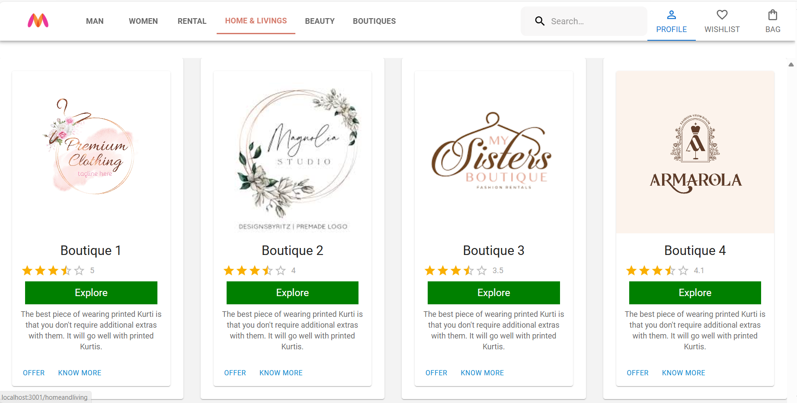
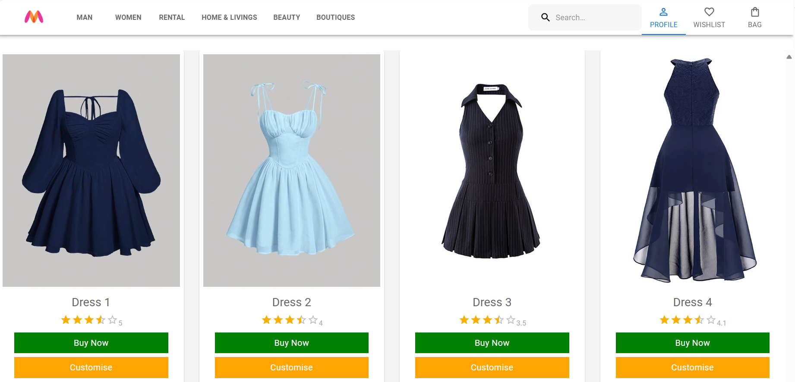
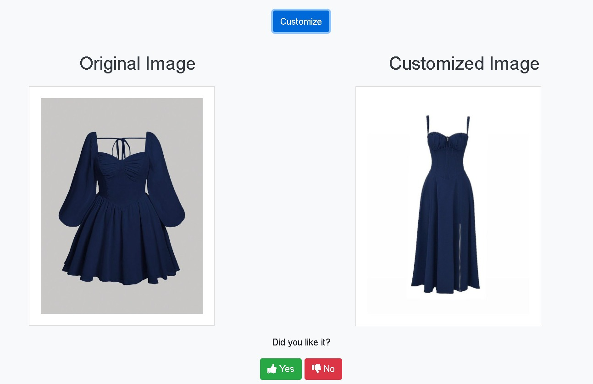
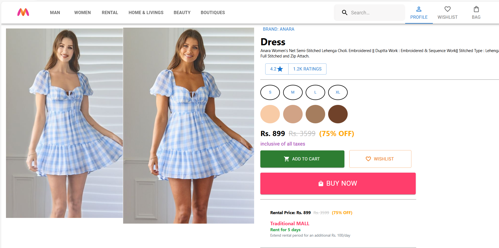

About Project
Myntra Clone is a web application inspired by Myntra, a leading e-commerce platform specializing in fashion and lifestyle products. This project aims to replicate key functionalities and provide a seamless shopping experience for users.
# Getting Started with Create React App

This project was bootstrapped with [Create React App](https://github.com/facebook/create-react-app).

## Available Scripts

In the project directory, you can run:

### `npm start`

Runs the app in the development mode.\
Open [http://localhost:3000](http://localhost:3000) to view it in your browser.

The page will reload when you make changes.\
You may also see any lint errors in the console.

Features
Boutiques
Explore unique boutiques offering curated collections from local designers and fashion influencers. Myntra Clone supports boutique integration to provide users with exclusive, handpicked fashion items not typically found in mainstream collections. Key features include:

Curated Collections: Discover exclusive clothing, accessories, and lifestyle products curated by boutique owners.
Local Designers: Support local designers and explore their latest creations.
Customization:Users can customize according to their requirements.Customized images are generated using an AI model,

Model Purpose:
model appears to be a "pix2pix" implementation, which is typically used for image-to-image translation tasks. In the context of dress customization, it's likely designed to take an input image of a dress and generate a modified version based on the training data.
Model Architecture:
The model you've shown is a "convolutional" neural network with a series of downsampling (encoder) and upsampling (decoder) layers. It's structured to process image data and output a transformed image.

Rental Feature
Rent fashion items for special occasions or everyday wear with Myntra's Rental feature. Ideal for those looking to experiment with new styles without committing to a purchase. 

 AI-powered filters that match models with your skin tone and size, helping you visualize how a particular dress will look on you.Select your skin tone, and AI will modify the dress according to your choice. Similarly, you can specify your size, and AI will show you how the dress will look in your size. This personalized approach helps you make informed fashion decisions tailored to your preferences and body type

Technologies Used
Frontend: React.js, Material-UI
Backend: Node.js, Express.js ,flask
Database: MongoDB 
ML: Pytorch,Pillow

